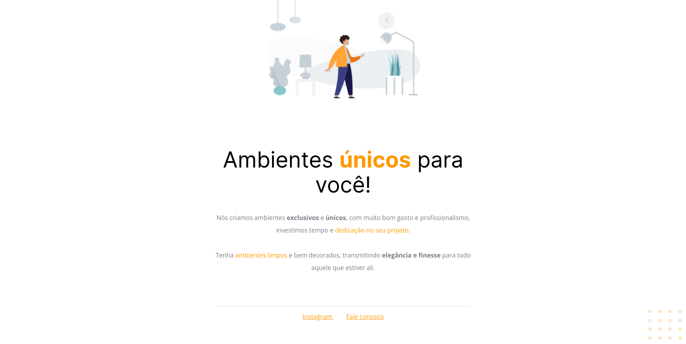

<h1 align="center"> Projeto 01 </h1>

Projeto desenvolvido em conjunto durante os estudos da trilha Explorer da Rocketseat.

  

#### Esse projeto foi desenvolvido com as seguintes tecnologias:

- HTML e CSS
- Git e Github
- Figma

#### Você pode visualizar o layout do projeto através [DESSE LINK](<https://www.figma.com/file/7NwK20aEb05csuYTG4hvM9/Explorer---Projeto-01-(Copy)?type=design&node-id=0-1&mode=design&t=ABE8JUi5bByplYvT-0>).
